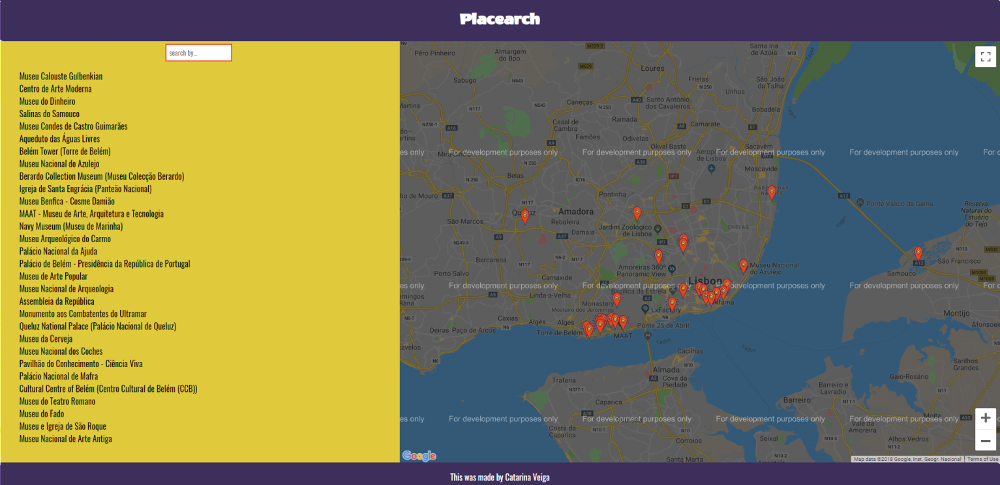
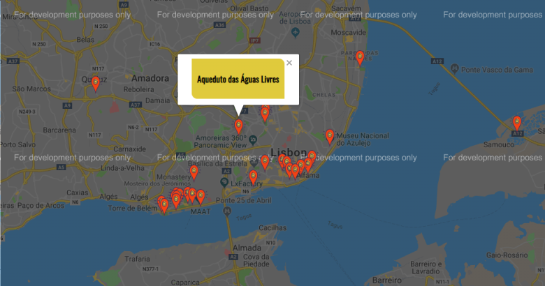
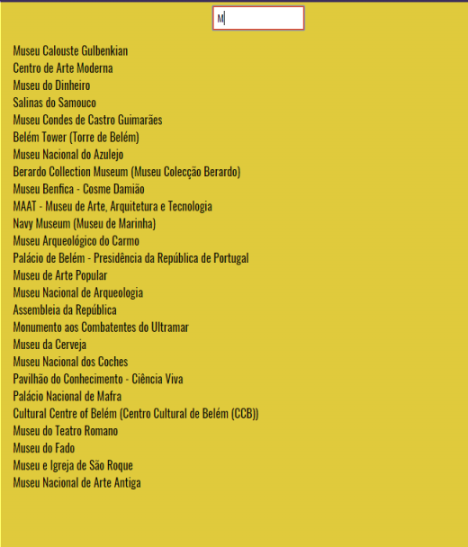

# Placearch

This was the last project built for the Udacity Front-End Nanodegree. The objective was create a map, with a list of locations, near by your neighborhood, using React.

## Live Preview

You can click on this emoji to see the live demo of this project

<a href=""></a>

## Instructions
To get started developing right away:

* install all the dependencies with

`npm install`

* start the development server with

`npm start`

* This app can be view in the localhost: 

`http://localhost:3000/`

## What you are getting, when install the repository on your computer

````
├── README.md - This file.
├── package.json # npm package manager file. It's unlikely that you'll need to modify this.
├── .gitignore # containing the all files that must be ignored
├── package-lock.json
├── public
│   ├── favicon.ico # the icon for the tab
│   ├── manifest.json
│   └── index.html # DO NOT MODIFY│
└── assets
    ├── screenshot1.png 
    ├── screenshot2.png
    ├── screenshot3.png
    ├── screenshot4.png
└── src
   ├── App.css # where the styling for this app are
   ├── App.js # Where the template is
   ├── App.test.js # Used for testing. Provided with Create React App
   ├── registerServiceWorker.js # The service worker provided by create-react-app
   ├── components # The paste containing all the components that I used for this app
   │   ├── map.js # where the map component and setup is
   │   └── places.js #  where the list with the locations setup are
   ├── index.css # Global styles. You probably won't need to change anything here.
   └── index.js # You should not need to modify this file. It is used for DOM rendering only.
````

## Considerations

This project was bootstrapped with <a href="https://github.com/facebook/create-react-app">Create React App</a>. You can find more information on how to perform common tasks here .
To load the Google Map, I used <a href="https://github.com/tomchentw/react-google-maps">react-google-maps</a>
And to fetch the API <a href="https://developer.foursquare.com/docs">Foursquare</a>, I used the <a href="https://visionmedia.github.io/superagent/">superagent package</a>

## ScreenShots


*When you open the app this is the view you are going to have: one side you will have a list with all locations choosen, and in the other side you will have the map*



*I changed a little bit the style of the things, and I decided to create a div to put the name of the marker, my idea was changed the InfoWindow, but I like it that way; you are able to click on the red markers to see the name of the locations*



*And if you want it, you can search the locations typing the name, and clicking them.*




## Important

* Please be aware, that I redo this project for so many times, that I exceed the request quota for this API key (Google), so if you want to see the markers you need to use your own API key.

* Also, please note the service worker only works in production mode. To build the app for production run:

`npm run build`

## Contributing

This repository was created by me, from scratch. Therefore, I will accept pull request, and open issues. But please, don't merge a pull request.

## Authors

Design the markers, and the idea, palette of colors, fonts: <a href="https://github.com/cveiga819">Catarina Veiga</a>
